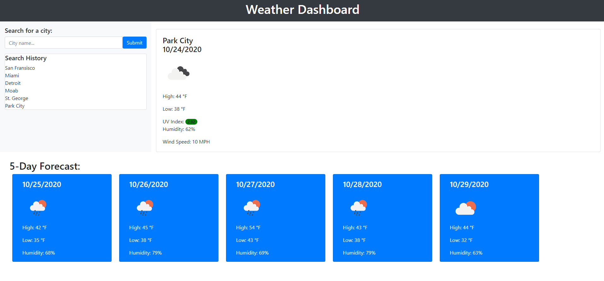

## Weather App Dashboard

This app works by:

-Any searched cities are added to the history, and the most recent one is displayed on the dash.
-Today's forcast displays the most details, with humidity, highs and lows, wind speed, and UV index.
-The five next days are displayed with highs and lows and humidity. All days also display an icon with the precipitation outlook.
-Cities that aren't found display a 404 and are removed from history.